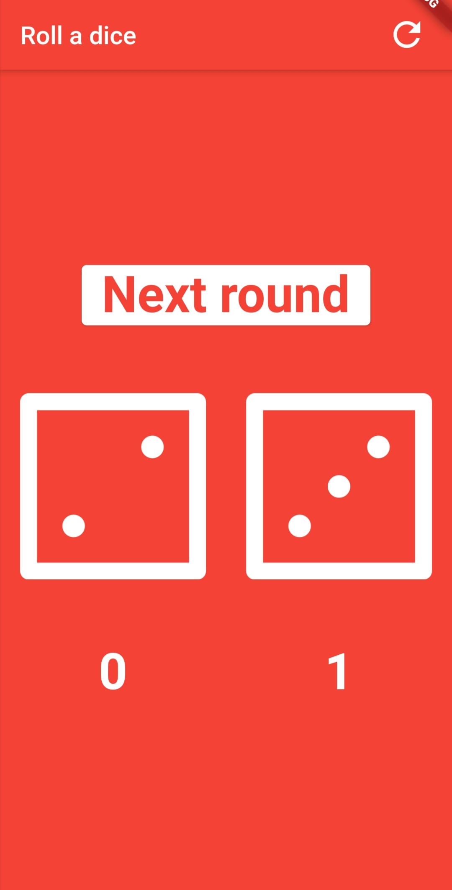

App developed in Flutter, based on https://github.com/londonappbrewery/dicee-flutter.

Added more options:
- counting players scores
- two dices has to be touched to count the score
- button with new round
- resetting score

